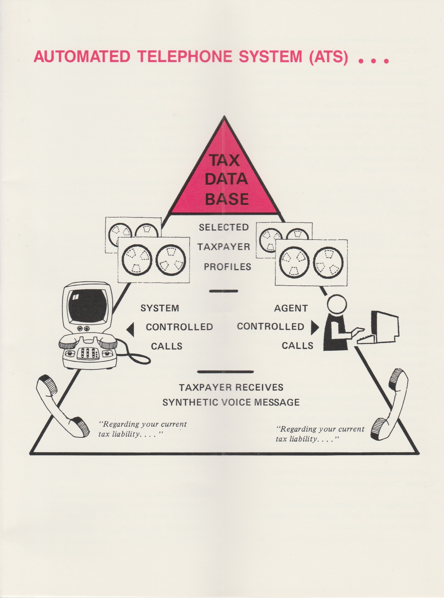

# automated-telephone-system

## Overview

This project contains images of content related to the Automated Telephone System (ATS) developed by the New York State Department of Taxation and Finance, released on March 19, 1987.

See it here &#8594; [https://melahn.github.io/automated-telephone-system/](https://melahn.github.io/automated-telephone-system/)

